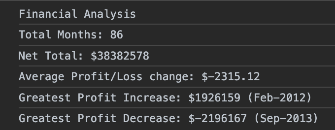

# Console Finances

Code for analysing the financial records of a company and determining profit/loss points.

# Description

Given data consisting of a companies profit/loss for a given month I want to write JavaScript code that analyses the data to calculate the following:

- The total number of months in the dataset
- The Net Total Profit over the entire period
- The averages of the changes in profit from month to month over the entire period
- The greatest increase in profit (date and amount) over the entire period
- The greatest loss in profit (date and amount) over the entire period

## Usage

The deployed site can be found at https://annabrisland.github.io/console-finances

## Credits

N/A

## License

[MIT](https://choosealicense.com/licenses/mit/)